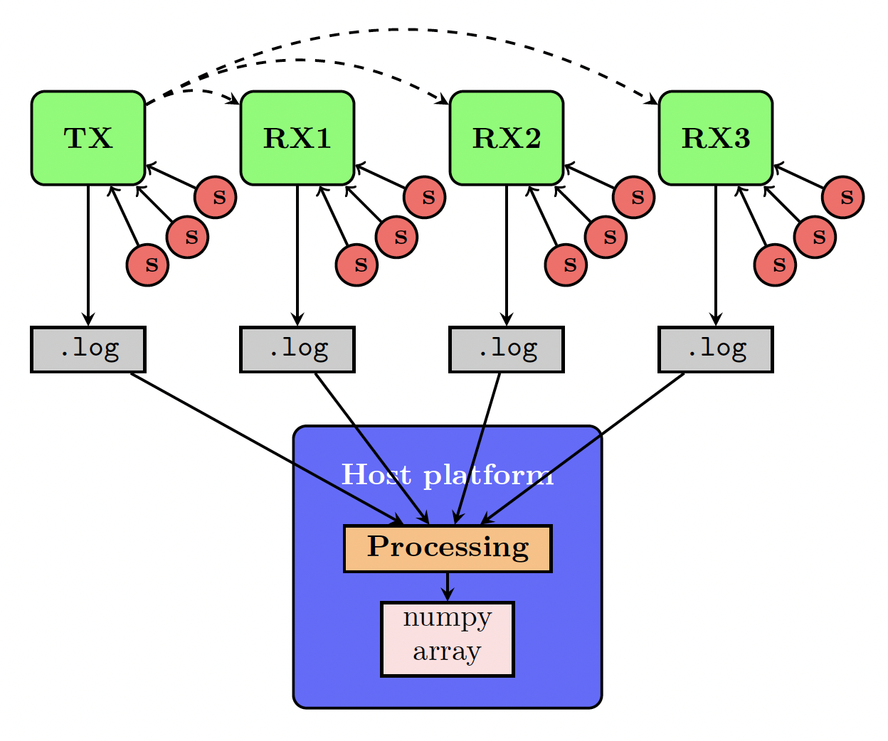

# 1 - Data recording (in Bela)

This code allows recording datasets of sensor signals recorded simultaneously in multiple Bela boards.  A clock signal (a digital bit) is sent from a transmitter Bela (TX) to the receiver Belas (RXs). The sensor values and the frames at which the clock signal is received (in the case of the RXs) or sent (in the case of the TX) are saved in `.log` files. Those files are processed in the next step of the pipeline.

This graph shows an example of the dataset recording and processing workflow for four Bela boards with 4 sensors connected to each. One Bela acts as transmitter (TX) and sends a clock signal (a digital bit, in the figure, represented by a dotted line) to the receivers (RX1, RX2 and RX3). The sensor values and frames at which the clock signal was sent or received are stored in `.log` files, which are copied into the host machine for later processing.



This implementation uses [@adanlbenito](https://github.com/adanlbenito)'s `BelaParallelComm` to send and receive clock signals across Bela boards.

Note: If you are using the same host machine to ssh into multiple Belas, you will need to change their default IP addresses. Instructions to do so are in the [knowledge base](https://learn.bela.io/using-bela/technical-explainers/ip-addresses/).

## Instructions

1. Connect the Bela TX digital IO pin to the Bela RXs pin 10.
2. If you have cloned this repo in your host machine in some path, you can copy it to the Belas by using (from the host machine's terminal):
  ```
  scp -r path/to/where/you/cloned/this/repo root@[the.bela.ip]:Bela/projects/
  ```

  You can also do it in bulk for all the Bela boards at once by doing (from the host machine):

  ```
  for REMOTE in "root@[bela.main.ip]:Bela/projects/" "root@[bela.receiver1.ip]:Bela/projects/" "root@[bela.receiver2.ip]:Bela/projects/"; do scp -r path/to/where/you/cloned/the/repo/ $REMOTE; done
  ```

3. Now you can compile the code for the Bela main. Ssh into the Bela main by doing `ssh root@[bela.main.ip]` and then run the following command (substitute M for the number of analog input pins used)

  ```
  make -C /root/Bela PROJECT=bela-data-logger CPPFLAGS="-DBELA_MASTER=1 -DNUM_INPUTS=M"
  ```

4. You can now compile the code for the receiver Belas. Ssh into the receiver Bela by doing `ssh root@[bela.receiverN.ip]` and then run the following command. Substitute N for the Bela receiver ID (0,1,2,..) (each Bela receiver should have its unique ID), and M by the number of analog sensors connected to the Bela board (in order, e.g., M=3 corresponds to channel 0, 1 and 2)

  ```
  make -C /root/Bela PROJECT=bela-data-logger CPPFLAGS="-DBELA_MASTER=0 -DBELA_ID=N -DNUM_INPUTS=M"
  ```
5. Now you can run the compiled code in every Bela. It is very important that the **receiver Belas start running before the transmitter Bela**. This assures that the first clock signal received at RXN is also the first clock signal sent by TX. In each Bela command line run::
  ```
  cd Bela/projects/bela-data-logger && ./bela-data-logger
  ```
6. The Belas are now recording the sensor values and the clock signals. Type `ctrl+C` on every Bela Terminal to stop the program or press the Bela cape button.
7. You can now copy the log files into your host machine by running (from the host machine Terminal):
  ```
  for REMOTE in "root@[bela.main.ip]:Bela/projects/bela-data-logger" "root@[bela.receiver1.ip]:Bela/projects/bela-data-logger" "root@[bela.receiver2.ip]:Bela/projects/bela-data-logger"; do scp $REMOTE\*.log path/where/you/want/the/logs/in/your/host/machine; done
  ```

In step 2 we will use the `DataSyncer` library to align all the sensor signals framewise and load them into a python numpy array.

